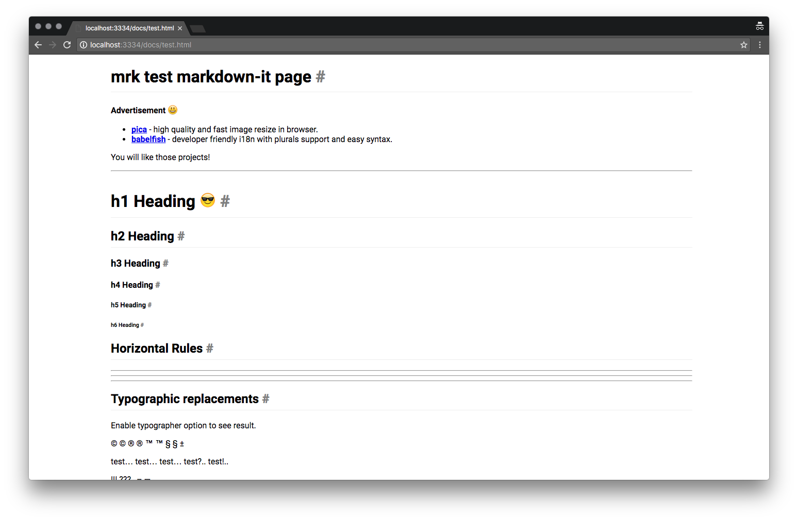

# mrk

[](https://www.bithound.io/github/alekzonder/mrk)
[](https://www.bithound.io/github/alekzonder/mrk)
[](https://www.bithound.io/github/alekzonder/mrk/master/dependencies/npm)

simple markdown server

can render and upload your docs to webdav

powered with [markdown-it](https://github.com/markdown-it/markdown-it)



# install

```
npm install -g mrk@latest
```

# usage

## start

- start markdown server on 3334 port for all network interfaces
- watch all .md files in current work directory
- recompile .md on change

open in browser http://localhost:3334

```
mrk

# OR

mrk start

# OR

mrk s
```

## render

render all .md files in current work directory to ./www_md directory

```
mrk render

# OR

mrk r
```

### options

`--footer <filepath>` - set your custom footer with analytics or js

## clean

clean all rendered files

```
mrk clean

# OR

mrk c
```

## upload

upload rendered files to webdav

```
mrk upload http://example.com/docs/
```

# LICENSE

MIT
